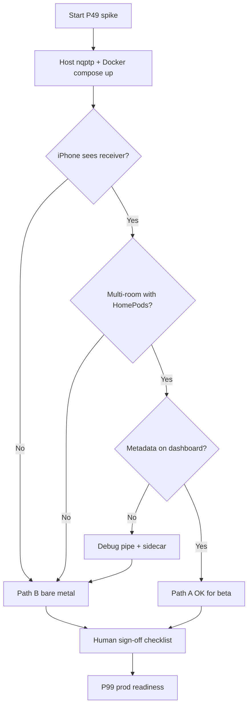

# P49 Docker spike — RPi4 AirPlay 2

**Purpose:** Validate Path A (Docker host-network) before committing to it for home beta.  
**Time box:** ~1 day of effort on real Pi hardware.  
**Fallback:** [deploy/rpi/README.md](../deploy/rpi/README.md) (Path B bare metal).

Cloud agents and CI **cannot** run this spike — only document steps and artifacts. Human sign-off is required.

---

## Spike hypothesis

On Raspberry Pi 4 with Raspberry Pi OS 64-bit:

1. **nqptp** runs on the **host** (systemd)
2. **shairport-sync** runs in Docker with `network_mode: host`
3. **airplay-status** Node app runs in Docker with `network_mode: host`
4. iPhone discovers **AirPlay Status (Beta)** and can group **HomePods + AirPlay Status** (AirPlay 2 multi-room)

---

## Pass criteria

| # | Criterion | How to verify |
|---|-----------|---------------|
| 1 | nqptp active on host | `systemctl is-active nqptp` |
| 2 | shairport-sync container running | `docker compose -f deploy/docker/docker-compose.yml ps` |
| 3 | Receiver visible on iPhone | Settings → AirPlay → **AirPlay Status (Beta)** |
| 4 | AP2 multi-room works | Select HomePods **and** AirPlay Status in one group |
| 5 | Dashboard metadata ≤ 5s | Play music; `http://<pi>:3003` updates title/artist |
| 6 | Version API | `curl http://<pi>:3003/api/version` → `deployPhase=p49`, `deployStage=beta` |

---

## Fail criteria (→ Path B immediately)

- iPhone never lists the receiver after 30+ minutes (mDNS / Avahi / firewall)
- Receiver appears but **only** as separate output (no multi-room with HomePods)
- Official `mikebrady/shairport-sync` image lacks AirPlay 2 on arm64
- nqptp conflicts when containerized; host nqptp + Docker still fails AP2 grouping
- Metadata pipe not shared between containers despite host network

When any fail criterion hits, stop the spike and run:

```bash
./bin/p49-down.sh docker
sudo ./deploy/rpi/install.sh
```

---

## Spike procedure (human, on Pi)

### 1. Prepare Pi

```bash
sudo apt update
sudo apt install -y docker.io docker-compose-plugin avahi-daemon git
sudo systemctl enable --now avahi-daemon docker
sudo usermod -aG docker "$USER"
# re-login for docker group
```

### 2. Clone and configure

```bash
git clone https://github.com/ritz-ras1245/airplay-status.git
cd airplay-status
cp config/deploy/beta.env.example .env
```

### 3. Install host nqptp

```bash
git clone --depth 1 --branch 1.2.4 https://github.com/mikebrady/nqptp.git /tmp/nqptp
make -C /tmp/nqptp && sudo make -C /tmp/nqptp install
sudo cp deploy/rpi/systemd/nqptp.service /etc/systemd/system/
sudo systemctl enable --now nqptp
```

### 4. Start Docker stack

```bash
./bin/p49-up.sh docker
./bin/check-version.sh http://localhost:3003
./bin/check-sidecar.sh
```

### 5. iPhone test

1. Same Wi‑Fi/LAN as Pi
2. Play Apple Music (or other source)
3. Open AirPlay picker
4. Confirm **AirPlay Status (Beta)** appears
5. Select **HomePods + AirPlay Status** together
6. Open dashboard on phone/desktop: `http://<pi-ip>:3003`
7. Confirm track title updates within 5 seconds

### 6. Record result

Fill in the spike log below and commit notes to your fork or issue comment.

---

## Spike log (template)

| Field | Value |
|-------|-------|
| Date | YYYY-MM-DD |
| Pi model / OS | RPi4 / Raspberry Pi OS 64-bit Lite |
| Docker version | `docker --version` |
| shairport-sync image | `mikebrady/shairport-sync:latest` digest |
| nqptp | host systemd |
| **Result** | PASS / FAIL |
| Multi-room with HomePods | YES / NO |
| Notes | |

---

## Human beta sign-off checklist

Complete **all** items before promoting to P99 prod readiness. These require home LAN, iPhone, and optionally HomePods/Tidbyt.

### Device tests (iPhone + speakers)

- [ ] iPhone selects **HomePods + AirPlay Status (Beta)** in **one** AirPlay group
- [ ] Dashboard shows live metadata within **5 seconds** of pressing play
- [ ] Album art appears when source sends cover art
- [ ] Pause/resume reflected on dashboard (may lag; use debug capture if wrong)
- [ ] Stop AirPlay session → dashboard clears within expected window

### Integrations (if enabled on branch)

- [ ] Tidbyt push works from Pi (`./bin/push-tidbyt.sh` or auto-push on play)
- [ ] Echo webhook reachable from Pi (P6 — only if merged; skip if not on `main`)

### Ops / API

- [ ] `GET /api/version` returns:
  - `"version": "0.1.0"` (or current semver)
  - `"deployPhase": "p49"`
  - `"deployStage": "beta"`
  - `"gitCommit": "<short-sha>"` (set `GIT_COMMIT` at deploy)
- [ ] `./bin/check-sidecar.sh` passes while music is playing to AirPlay Status
- [ ] `./bin/check-version.sh http://<pi>:3003` succeeds from another LAN machine

### Soak and reboot

- [ ] **24-hour soak** — no manual restart required; metadata still updates next day
- [ ] **Reboot Pi** → `nqptp`, `shairport-sync`, and `airplay-status` auto-start (Path B systemd)
  - Docker path: confirm `restart: unless-stopped` brings containers back; host nqptp enabled

### Documentation

- [ ] Fresh install from `deploy/rpi/README.md` **or** `deploy/docker/README.md` works on a clean SD card
- [ ] Beta `.env` copied from `config/deploy/beta.env.example` (secrets not committed)

---

## Expected cloud agent outcome

Agents implement artifacts and verify **mock dashboard** smoke tests only:

```bash
npm ci
bash .cursor/cloud-bootstrap.sh
USE_MOCK=true SKIP_SHAIRPORT_CHECK=1 npm start &
curl -sf http://localhost:3003/api/version
curl -sf 'http://localhost:3003/api/status?mock=true'
```

Pi/AirPlay validation is **explicitly out of scope** for cloud VMs.

---

## Decision tree



---

## References

- [specs/p49-preprod-deployment.md](../specs/p49-preprod-deployment.md)
- [deploy/docker/README.md](../deploy/docker/README.md)
- [deploy/rpi/README.md](../deploy/rpi/README.md)
- [docs/multi-room-airplay.md](multi-room-airplay.md)
- [nqptp](https://github.com/mikebrady/nqptp)
- [shairport-sync BUILD.md](https://github.com/mikebrady/shairport-sync/blob/master/BUILD.md)
