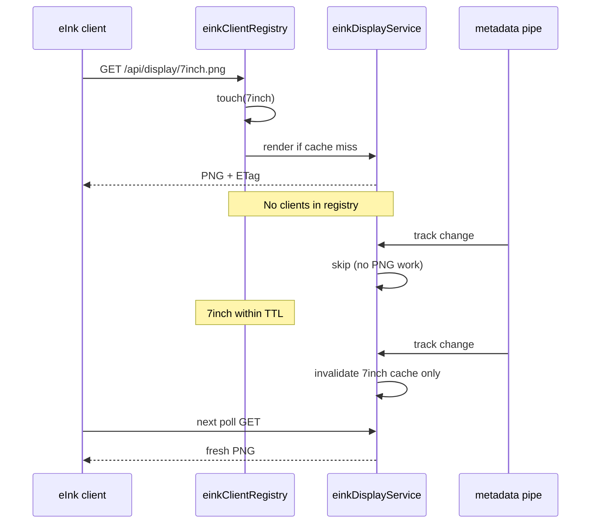

# Phase P3 — Kindle / eInk Read-Only Display

**Status:** Browser `/eink` MVP + transport forms on P1 branch. Full P3 PNG pipeline still spec.  
**Depends on:** Phase 4 live metadata (`/api/status`)  
**Optional dependency:** P1 not required (display-only)

## Goal

Show AirPlay now-playing on a Kindle or other eInk device as a **read-only** wall display or bedside screen: album art, title, artist, album, and static progress text at last refresh.

No live progress animation — eInk refresh is slow and battery-intensive; the display updates on a fixed interval only.

## Assumptions

- Kindle is **already jailbroken** and/or the **Kindle browser** can reach the airplay-status host on the LAN.
- No jailbreak instructions in this spec or repo.
- User has selected **AirPlay Status** as an AirPlay output (same as main dashboard).

## Feasibility

| Aspect | Assessment |
|--------|------------|
| **Overall** | **Yes** — browser path is straightforward; PNG fetch path suits always-on jailbroken setups |
| **Kindle browser** | Works on stock or jailbroken devices if LAN HTTP is reachable |
| **kindle-dash / TRMNL** | **Yes** — poll PNG URL; server renders **on demand** for connected profiles only |
| **Live progress bar** | **Out of scope** — no second-by-second animation; optional **segmented** bar (see below) |

## Architecture

```
┌──────────────────┐
│ airplay-status   │
│ /api/status      │
└────────┬─────────┘
         │
    ┌────┴────────────────────────────┐
    ▼                                 ▼
┌────────┐              ┌──────────────────────────┐
│ /eink  │              │ /api/display/:profile.png │
│ HTML   │              │ (on-demand PNG only)      │
└───┬────┘              └─────────────┬────────────┘
    │                                 │
    │         touch client TTL        │
    └──────────────┬──────────────────┘
                   ▼
         ┌─────────────────────┐
         │ einkClientRegistry  │  active profiles + lastSeen
         └──────────┬──────────┘
                    │ render PNG only when:
                    │  • client requested (GET)
                    │  • profile in active set (within TTL)
                    ▼
              [no clients → no PNG work]
```

Both paths consume the **same** playback state from `airplayMetadataService` — no duplicate pipe parsing. **PNG images are never pre-rendered in the background** when no eInk client is connected.

## Path A — Kindle browser (recommended MVP)

Serve a minimal page at **`GET /eink`** (alias **`GET /kindle`** optional redirect).

### Why not SSE?

Kindle browsers are slow and often lack reliable EventSource support. Use simple polling or meta refresh instead.

### Refresh strategy

| Method | Interval | Notes |
|--------|----------|-------|
| `<meta http-equiv="refresh" content="60">` | 60s | Works without JavaScript; primary fallback |
| Optional JS `fetch('/api/status')` | 60–120s | Update DOM without full page reload if JS works |

**Decision:** Ship meta refresh first; add lightweight JS polling as enhancement if tested on target device.

### Layout requirements

- **Typography:** Large, high-contrast text; sans-serif; minimum 18px body on 6" screens
- **Color:** Grayscale-friendly CSS (`color: #000`, `background: #fff`); no gradients or subtle grays that ghost on eInk
- **Album art:** Small thumbnail (e.g. 120×120 max); optional — hide if art URL fails
- **Progress:** Static text, e.g. `1:35 / 3:11` from `progressMs` and `durationMs` at page render time
- **Empty state:** "Nothing playing" + short reminder to select AirPlay Status
- **No smooth progress animation** — optional segmented bar (below) advances one step per refresh; no sub-interval updates

### Optional: segmented progress bar + adaptive refresh (low priority)

Instead of a continuously updating bar (bad on eInk) or text-only progress, divide the bar into a **small number of discrete segments** whose width matches what the display can meaningfully show. Tie page refresh to segment duration so the bar **steps forward** in sync with playback without extra polls.

**Example:** 3 min track (180 s), 9 cm bar width → 9 segments (~1 cm each) → refresh every **20 s**. After each refresh, one more segment fills.

#### Segment count

Derive from bar width and a minimum segment size (physical or pixel), not from track length alone:

```
minSegmentPx   = EINK_SEGMENT_MIN_PX   // default ~24 (~1 cm at typical Kindle DPI)
barWidthPx     = EINK_PROGRESS_BAR_PX  // default ~216 (~9 cm equivalent)
segmentCount   = clamp(floor(barWidthPx / minSegmentPx), 3, EINK_SEGMENT_MAX)
```

Cap `segmentCount` (default max 20) so very wide layouts do not over-poll. For podcasts or long tracks, segments represent **larger time chunks** — acceptable on eInk; ultra-smooth progress is not the goal.

#### Adaptive refresh rate

When a track is playing and `durationMs > 0`:

```
refreshRateSec = clamp(
  ceil(durationMs / 1000 / segmentCount),
  EINK_REFRESH_MIN_SEC,   // default 10
  EINK_REFRESH_MAX_SEC    // default 120
)
```

When paused, idle, or no duration: fall back to `EINK_REFRESH_SEC` (default 60).

| Track | Segments | Refresh |
|-------|----------|---------|
| 3:00 (180 s) | 9 | 20 s |
| 4:30 (270 s) | 9 | 30 s |
| 0:45 (45 s) | 9 | 10 s (min clamp) |

#### Filled segments at render time

```
filledSegments = isPlaying && durationMs > 0
  ? clamp(floor(progressMs / durationMs * segmentCount), 0, segmentCount)
  : 0
```

Render as a row of `<span>` or `<div>` blocks (filled vs empty). No CSS transitions — eInk ghosting makes animation undesirable.

#### Template / API parameters

Server computes on each `/eink` render and passes to the template (and optionally as query hints for PNG path):

| Parameter | Type | Description |
|-----------|------|-------------|
| `refreshRateSec` | number | `<meta http-equiv="refresh">` content value |
| `segmentCount` | number | Total bar divisions |
| `filledSegments` | number | Segments filled at this render |
| `progressText` | string | e.g. `1:35 / 3:11` (unchanged) |

Example meta tag:

```html
<meta http-equiv="refresh" content="<%= refreshRateSec %>">
```

Optional: expose the same fields on `/api/status` under an `eink` key when `?eink=1` — defer unless PNG path needs it.

#### PNG path

Same segment math in `einkDisplayService.js` when that profile is **active** (see [On-demand PNG generation](#on-demand-png-generation-connected-clients--ttl)). kindle-dash cron interval should match `refreshRateSec` when possible.

**Priority:** Optional P3 enhancement — ship text-only progress first; add segmented bar when `/eink` MVP is stable. Per-device tuning: [P3.1 Side-Quest](#p31-side-quest--device-profiles).

## P3.1 Side-Quest — Device profiles

**Status:** Side-quest (optional, after P3 MVP)  
**Depends on:** P3 `/eink` MVP; optional segmented bar above

### Goal

Support **known eInk layouts** with tuned bar width, segment size, PNG resolution, and refresh bounds. Profiles use **generic ids** (screen size, PPI class, or numbered `profileN`) — not brand/model names. You map your physical Kindle or eInk screen to whichever profile fits. Unidentified clients use **`default`**: progress text only, **no segmented bar** unless explicitly enabled on default.

### Profile id naming

Ids are URL-safe, lowercase, no spaces — describe **display class**, not hardware SKU:

| Style | Examples | Use when |
|-------|----------|----------|
| Screen size | `6inch`, `7inch`, `10inch` | Diagonal is the main variable |
| Pixel density | `167ppi`, `227ppi`, `300ppi` | PPI drives segment/bar sizing |
| Numbered | `profile1`, `profile2`, `profile3` | Custom tune; note hardware in `label` |

Rules:

- **`default`** — always present; unidentified clients land here
- **`label`** — free-text note, e.g. `"Bedside Kindle (~7\" 300ppi)"`; not used for lookup
- Add or rename profiles in `config/eink-devices.json` without code changes
- Do **not** encode vendor/model in the id (`kindle-pw3` etc. avoided)

### Device identification

Kindle browsers often share generic user agents — do **not** rely on UA alone.

| Method | Example | Priority |
|--------|---------|----------|
| Query param | `/eink?device=7inch` | **Primary** — bookmark on device |
| PNG path segment | `/api/display/300ppi.png` | Fetch clients (kindle-dash) |
| Env override | `EINK_DEVICE_ID=profile1` | Single-device home install |
| User-Agent hint | Optional fallback only | Low confidence |

Lookup order: query param → env → `default`.

```
deviceId = req.query.device || process.env.EINK_DEVICE_ID || 'default'
profile  = einkDevices[deviceId] ?? einkDevices.default
```

Unknown id (typo): treat as **`default`**, not an error.

### Config file

**Path:** `config/eink-devices.json` (committed example: `config/eink-devices.example.json`)

```json
{
  "default": {
    "label": "Generic / unidentified eInk",
    "showProgressBar": false,
    "progressBarPx": 216,
    "segmentMinPx": 24,
    "segmentMax": 20,
    "refreshSec": 60,
    "refreshMinSec": 10,
    "refreshMaxSec": 120,
    "pngWidth": 600,
    "pngHeight": 800
  },
  "7inch": {
    "label": "~7\" eInk class (owner: map your device here)",
    "showProgressBar": true,
    "progressBarPx": 216,
    "segmentMinPx": 24,
    "segmentMax": 9,
    "refreshSec": 60,
    "refreshMinSec": 10,
    "refreshMaxSec": 120,
    "pngWidth": 758,
    "pngHeight": 1024
  },
  "300ppi": {
    "label": "300ppi density class",
    "showProgressBar": true,
    "progressBarPx": 240,
    "segmentMinPx": 26,
    "segmentMax": 9,
    "refreshSec": 60,
    "refreshMinSec": 10,
    "refreshMaxSec": 120,
    "pngWidth": 758,
    "pngHeight": 1024
  }
}
```

**Example profiles** in the committed example (tune dimensions when hardware is known):

| Profile id | Intent | Owner action |
|------------|--------|--------------|
| `default` | Unknown client | No bar; safe fallback |
| `6inch` | Small eInk | Adjust `pngWidth`/`pngHeight` |
| `7inch` | Common Kindle-class | Bookmark `/eink?device=7inch` |
| `10inch` | Large eInk / TRMNL-class | Wider bar, more segments |
| `167ppi`, `227ppi`, `300ppi` | Density-based segment sizing | Pick closest PPI |
| `profile1`, `profile2` | Scratch profiles | Put hardware note in `label` |

### Profile fields

| Field | Purpose |
|-------|---------|
| `label` | Human name in debug footer / docs |
| `showProgressBar` | If `false`, text progress only (filled segments hidden) |
| `progressBarPx` | Bar width for segment math |
| `segmentMinPx` | Min block width (~1 cm equivalent on this screen) |
| `segmentMax` | Cap segment count |
| `refreshSec` | Idle/paused fallback refresh |
| `refreshMinSec` / `refreshMaxSec` | Adaptive refresh clamps when bar enabled |
| `pngWidth` / `pngHeight` | PNG render size for fetch path |

Env vars (`EINK_PROGRESS_BAR_PX`, etc.) **override** profile values when set — useful for one-off testing.

### Render behavior by profile

| Client | `showProgressBar` | Segmented bar | `refreshRateSec` |
|--------|-------------------|---------------|------------------|
| Known device, `true` | yes | stepped bar + text | adaptive from track |
| Known device, `false` | no | text only | `refreshSec` |
| Unknown / `default` | `false` (default) | **hidden** | `refreshSec` |

Template receives `deviceId`, `deviceLabel`, `showProgressBar`, plus existing `refreshRateSec`, `segmentCount`, `filledSegments`.

Optional debug footer (when `METADATA_DEBUG=1` or `?debug=1` on eInk): `device: 7inch (~7" eInk class)`.

### Module (planned)

```
src/lib/einkDeviceProfile.js   # load config, resolve id, merge env overrides
```

Used by `/eink` route and `einkDisplayService.js` (PNG path).

### Acceptance criteria (P3.1)

- [ ] `config/eink-devices.example.json` checked in with `default` + placeholder ids
- [ ] `/eink?device=<id>` applies profile; missing id → `default`
- [ ] Unidentified clients: text progress only, no segmented bar (unless `default.showProgressBar` changed)
- [ ] Owner can add or tune profiles in `eink-devices.json` without code changes (generic ids only)
- [ ] PNG path respects device profile dimensions
- [ ] PNG generated on GET only; active profiles tracked via TTL

### Out of scope (P3.1)

- Auto-discovery of hardware model from UA
- Per-user multi-device routing on one server (single `EINK_DEVICE_ID` env is enough for MVP)

### Template (planned)

```
src/views/eink.ejs
src/public/css/eink.css
```

Route in `src/index.js`:

```js
app.get('/eink', async (req, res) => { /* render eink.ejs with playback state */ });
app.get('/kindle', (req, res) => res.redirect('/eink'));
```

Server-render on each request (meta refresh reloads full page). No client-side state management required for MVP.

## Path B — Jailbroken fetch client (wall display)

For always-on displays using [kindle-dash](https://github.com/pascalw/kindle-dash), TRMNL, or custom cron scripts that **poll** a PNG URL.

### Endpoint

```
GET /api/display/kindle.png          # alias → default profile
GET /api/display/:profileId.png      # e.g. 7inch.png, 300ppi.png
```

Returns a **grayscale PNG** at resolution from device profile ([P3.1](#p31-side-quest--device-profiles)). Images are **generated on demand** when a client requests them — not on a server timer or on every playback change.

### On-demand PNG generation (connected clients + TTL)

**Rule:** If no eInk client has connected recently, the server **does not generate PNGs at all** — no background render loop, no pre-warm on track change, no CPU spent on unused profiles.

A client is **connected** when it has hit an eInk endpoint within the TTL window:

| Endpoint | Registers profile |
|----------|-------------------|
| `GET /api/display/:profileId.png` | `:profileId` (or `default` for `kindle.png`) |
| `GET /eink?device=<profileId>` | `<profileId>` |

**Registry (planned):** `einkClientRegistry` — `Map<profileId, { lastSeenAt, source: 'png'|'html' }>`

```
On GET /api/display/7inch.png (or /eink?device=7inch):
  1. touch(profileId)           // lastSeenAt = now
  2. if cache hit + ETag match → 304 or cached bytes
  3. else → render PNG once, respond, store in profile-scoped cache

On playback change (metadata pipe):
  if activeProfiles.isEmpty() → return immediately (no render)
  else → invalidate cache keys for active profiles only
        (actual bytes rendered on next GET, not eagerly)

Every EINK_CLIENT_SWEEP_SEC:
  prune profiles where now - lastSeenAt > EINK_CLIENT_TTL_SEC
  evict PNG cache for pruned profiles
```



**Lazy by default:** First request after idle may be slower (cold render). Acceptable — wall displays poll on their own schedule.

**Zero clients:** Pi/ Mac CPU cost for PNG path is **nil** until something on the LAN actually uses it.

### Default resolution

Use `config/eink-devices.json` per device id; env vars override when set.

| Profile id | Intent | PNG size (placeholder) |
|------------|--------|------------------------|
| `default` | Unidentified | 600 × 800 |
| `6inch` | Small eInk | 600 × 800 |
| `7inch` | Medium eInk | 758 × 1024 |
| `10inch` | Large eInk | 960 × 1280 |
| `300ppi` | High-density class | 758 × 1024 |
| `profile1` | Custom | owner-tuned |

### Rendering

**Planned module:** `src/services/einkDisplayService.js`

- Render PNG **only** inside the GET handler when profile is active (within TTL) or on that same request’s first touch
- Read `getPlaybackState()` from `airplayMetadataService`
- Server-side render via `@resvg/resvg-js`, `sharp`, or `canvas` (choose during implementation)
- Grayscale conversion + dithering for eInk readability
- **Profile-scoped cache:** `Map<profileId, { buffer, etag, renderedAt }>` — evicted when client TTL expires

**Planned module:** `src/lib/einkClientRegistry.js`

- `touch(profileId, source)` on eInk routes
- `getActiveProfiles()` — profiles within TTL
- `prune()` — drop stale clients and trigger cache eviction

Do **not** subscribe to `onPlaybackChange()` for PNG render unless `getActiveProfiles().length > 0`; then invalidate cache only.

### Caching and ETag

```
ETag: "<hash of profileId + title + artist + album + isPlaying + filledSegments>"
Cache-Control: no-cache
```

Fetch clients send `If-None-Match`; server returns **304 Not Modified** when unchanged — saves battery and avoids redundant renders **for connected profiles only**.

Inactive profiles (TTL expired): cache entry removed; next GET is a cold touch + render.

### Optional SVG endpoint

```
GET /api/display/kindle.svg
```

Sharp text at low server cost; useful for devices that render SVG well. **Defer** if PNG path is sufficient for MVP.

## Configuration

| Variable | Required | Default | Description |
|----------|----------|---------|-------------|
| `EINK_REFRESH_SEC` | No | `60` | Fallback meta refresh when paused/idle/no track |
| `EINK_REFRESH_MIN_SEC` | No | `10` | Floor for adaptive refresh (segmented bar) |
| `EINK_REFRESH_MAX_SEC` | No | `120` | Ceiling for adaptive refresh |
| `EINK_PROGRESS_BAR_PX` | No | `216` | Progress bar width in px (~9 cm equivalent) |
| `EINK_SEGMENT_MIN_PX` | No | `24` | Min segment width (~1 cm); drives `segmentCount` |
| `EINK_SEGMENT_MAX` | No | `20` | Max segments across bar width |
| `EINK_WIDTH` | No | `758` | PNG width (fetch path) |
| `EINK_HEIGHT` | No | `1024` | PNG height (fetch path) |
| `EINK_ENABLED` | No | `1` | Set `0` to disable `/eink` and PNG routes |
| `EINK_DEVICE_ID` | No | — | Default device profile when query param omitted |
| `EINK_CLIENT_TTL_SEC` | No | `300` | Drop profile from active set after no requests (5 min) |
| `EINK_CLIENT_SWEEP_SEC` | No | `60` | Interval to prune expired clients + evict PNG cache |

Per-device fields live in `config/eink-devices.json` ([P3.1](#p31-side-quest--device-profiles)). Env vars above override profile values.

**TTL guidance:** Set `EINK_CLIENT_TTL_SEC` to ~3× the client poll interval (e.g. 180s for 60s kindle-dash cron). Browser `/eink` meta-refresh counts as activity each reload.

## Public API additions

| Method | Path | Description |
|--------|------|-------------|
| GET | `/eink?device=<id>` | HTML; profile from [P3.1](#p31-side-quest--device-profiles) |
| GET | `/kindle` | Redirect to `/eink` |
| GET | `/api/display/kindle.png` | PNG at default/generic profile |
| GET | `/api/display/:deviceId.png` | PNG at named device profile (P3.1) |
| GET | `/api/display/kindle.svg` | Optional vector display (future) |

`/api/status` unchanged — eInk pages are consumers, not a new state source.

## File structure (planned)

```
config/
├── eink-devices.example.json   # P3.1 device profiles (copy to eink-devices.json)
src/
├── lib/
│   ├── einkDeviceProfile.js    # P3.1 profile loader
│   └── einkClientRegistry.js   # connected profiles + TTL
├── views/
│   └── eink.ejs
├── public/css/
│   └── eink.css
├── services/
│   └── einkDisplayService.js   # on-demand PNG render + profile cache
└── index.js                    # /eink, /api/display/*.png routes
specs/
└── p3-eink-display.md
```

## Acceptance criteria

- [ ] `/eink` loads on Kindle browser over LAN HTTP
- [ ] Page shows title, artist, album, playing/paused, static progress text
- [ ] Page refreshes within 60–120s without manual reload
- [ ] Empty state when nothing playing
- [ ] `/api/display/7inch.png` returns valid PNG when requested
- [ ] ETag / 304 works when playback state unchanged (connected profile)
- [ ] **No PNG renders** when zero eInk clients within TTL (verify via logs / CPU)
- [ ] Track change invalidates cache for active profiles only; no render until next GET
- [ ] TTL expiry prunes profile and evicts its PNG cache
- [ ] No smooth/live progress animation (by design)
- [ ] *(Optional)* Segmented progress bar with `refreshRateSec` derived from track length and segment count
- [ ] *(P3.1)* Device profiles in `config/eink-devices.json`; unknown → default (no bar)

## Acceptance test matrix

| # | Path | Action | Expected |
|---|------|--------|----------|
| 1 | Browser | Open `/eink` while playing | Title, artist, art visible |
| 2 | Browser | Wait 60s | Page reloads; progress text may update |
| 3 | Browser | Stop AirPlay | Empty state on next refresh |
| 4 | PNG | `curl /api/display/7inch.png` while idle elsewhere | Valid PNG; profile registered |
| 5 | PNG | Same request + `If-None-Match` | 304 response |
| 6 | PNG | Track change, no GET yet | No render in logs until next curl |
| 7 | PNG | No requests for > TTL | Profile pruned; track change → no PNG work |
| 8 | PNG | Track change + active client polls | 200 with updated image |

## Out of scope (P3)

- Transport controls (see [p4-eink-controls.md](./p4-eink-controls.md))
- Jailbreak setup or KOReader plugin development
- Continuous second-by-second progress updates (segmented step bar is optional; see above)
- Cloud or HTTPS exposure (LAN only)
- Auto-discovery of Kindle model (P3.1 uses explicit device ids)

## Risks and mitigations

| Risk | Mitigation |
|------|------------|
| Kindle browser cannot reach LAN IP | Document host IP in README; test on same subnet |
| JS fetch unreliable | Meta refresh as primary; forms not needed until P4 |
| PNG render CPU on Pi | On-demand + TTL; zero work with no connected clients |
| Ghosting on frequent PNG refresh | ETag 304; client poll ≥60s; server never pushes unprompted PNGs |

## Success criteria

- [ ] Browser MVP (`/eink`) works on at least one Kindle or eInk browser
- [ ] PNG endpoint works with kindle-dash-style polling (on demand)
- [ ] No PNG generation when no eInk clients connected within TTL
- [ ] Display reflects same state as main dashboard without duplicate metadata parsing

## References

- [kindle-dash](https://github.com/pascalw/kindle-dash) — cron PNG fetch pattern
- [p4-eink-controls.md](./p4-eink-controls.md) — controls layered on this display
- Phase 4 playback state — `src/lib/metadataParser.js`, `/api/status`
